# CMPT 459 Final Project Report
Authors: Jonathan Jung - 301459402, Seong Hyeon (Kevin) Park - 301396855, Severn (Sevy) Veeken - 301571252

Dataset used for this project: https://www.kaggle.com/competitions/house-prices-advanced-regression-techniques/data

## Dataset Choice
For our project, we chose to use a [dataset](https://www.kaggle.com/competitions/house-prices-advanced-regression-techniques/data) containing information about house prices. We sourced the dataset from kaggle. Initially, this dataset was for regression problems, so to modify it for classification use, we separated houses into classes based on the price they sold for. In other words, each class reflects a price range.

## Data Preprocessing
To preprocess the data, we first handled numerical features. There were only 3 numerical features that had missing values, Lot frontage, Masonry veneer area, and Year garage was built. For Lot frontage, the missing values were filled in with the medium of the column. For Masonry veneer area, there were very few missing values so rows with missing values for this feature were dropped. Finally, for Year garage was built, missing values were filled in with the year the corresponding house was built. After missing values were handled, all numerical features were standardized using StandardScaler as many different features had different ranges of values.

To handle missing categorical values, all missing values in each column were replaced with ‘unknown’. Then since many of the categorical values were not ordinal, all categorical variables were hot-one encoded not label encoded.

This dataset that we used was originally intended for regression tasks, so in order to explore classification algorithms we created class labels by binning together houses in the same price range. Originally we had intended to do 5 classes as follows:

0: Houses sold for < 100,000

1: Houses sold for 100,000 <= sale price < 200,000

3: Houses sold for 200,000 <= sale price < 300,000

4: Houses sold for 300,000 <= sale price < 400,000

5: Houses sold for > 400,000

However, upon our EDA (as is further explained and visualized below), we realized that this would cause the data set to be very imbalanced as the data set contained very few houses sold for more than 400,000 and the majority of the houses were all in class 1. Upon further exploring the data, and considering its nature we decided to use the following classes instead:

0: Houses sold for < 100,000

1: Houses sold for 100,000 <= sale price < 150,000

2: Houses sold for 150,000 <= sale price < 200,000

3: Houses sold for 200,000 <= sale price < 300,000

4: Houses sold for >= 300,000

We felt this binning was appropriate because people with lower budgets while searching for homes to buy also have tighter budgets, while those with larger budgets typically have a wider range of prices they are willing to consider. This labelling made the data much more balanced.To further balance the data we also performed data reduction for classes 1 and 2 as they still had substantially more data than the other classes. We did this by random sampling subsets of the data belonging to both classes. After the data reduction, we still had over 1000 rows of data to work with.

Finally, because the dataset we used has very high dimensionality (79 features) we performed PCA before doing some of the following tasks for the project. This allowed for better algorithm performance and better visualizations.

## Exploratory Data Analysis
Performing Exploratory Data Analysis revealed some notable relationships between some of the multitude of different features present within the data set. For starters the variables OverallQual and OverallCond, denoting the quality and condition of the property respectively, have clear connections to the sale price of the properties. For instance there is a near linear relationship between sale price and the quality rating. 

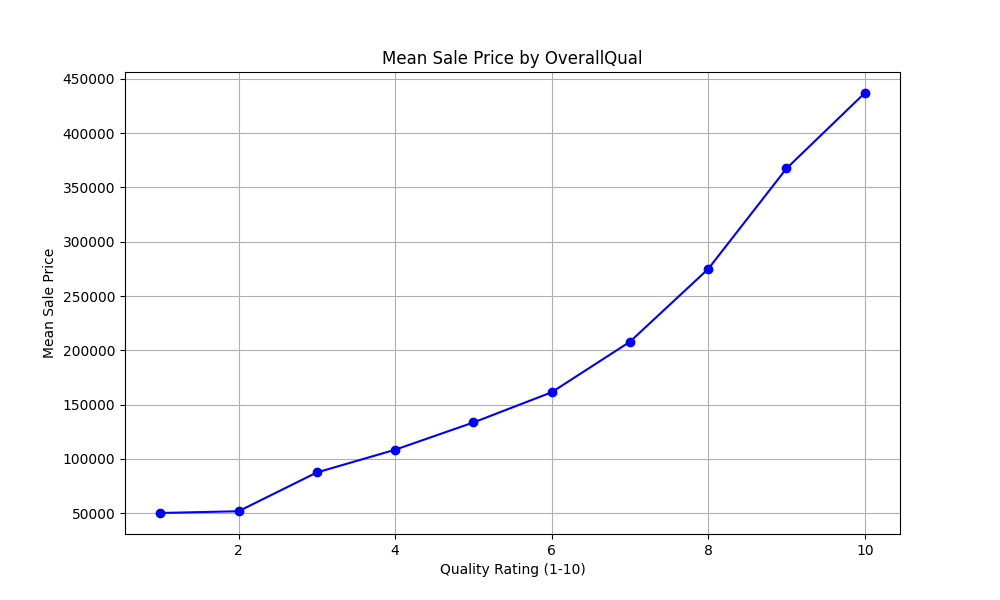

Interestingly, properties with condition ratings of 5 and 9 had by far the highest average sale price while having a dip in the 6 to 9 range. This could likely be due to a few outlier properties within the 5 condition rating category skewing the average calculation. 

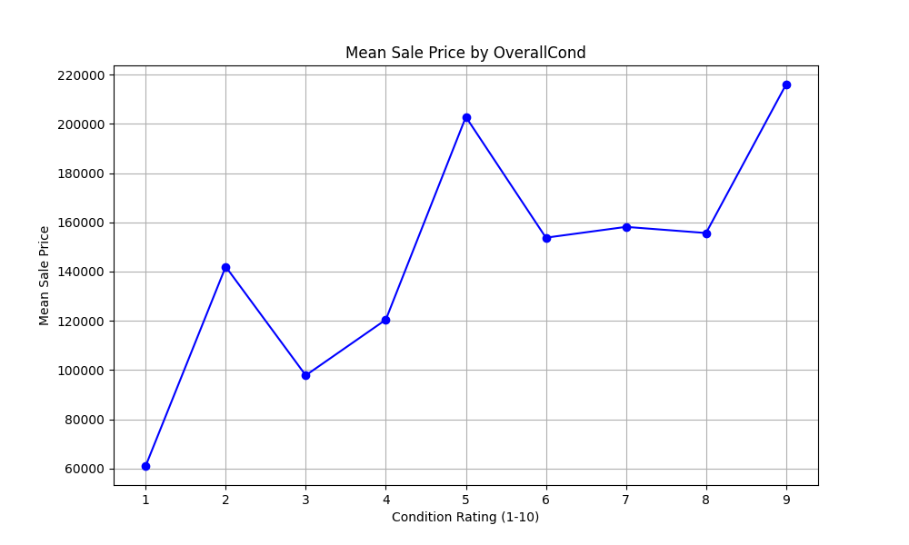

A heatmap pertaining to the Average property sale price mapped against the overall quality and condition was produced. The heatmap displayed a general correlation between higher ratings of each type. As illustrated below, the average sale prices are higher in the bottom left corner of the heat map.

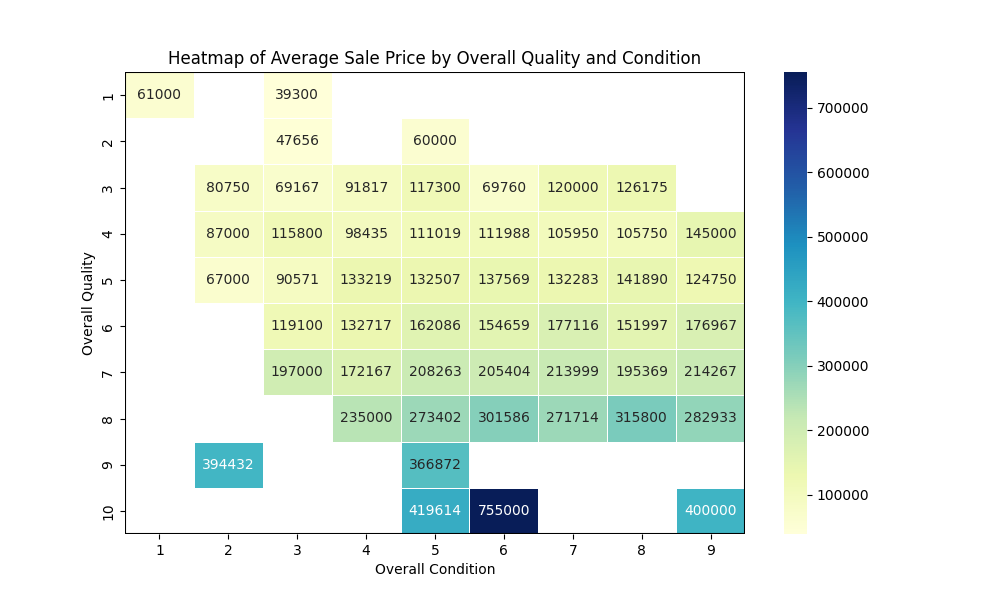

One of the biggest potential challenges with our current dataset is the price category feature. After plotting a histogram of the distribution between each category, it became clear that price category 1 pertaining to houses within the price range of $100,000 to $200,000 had a disproportionately larger number of samples compared to the other categories. 

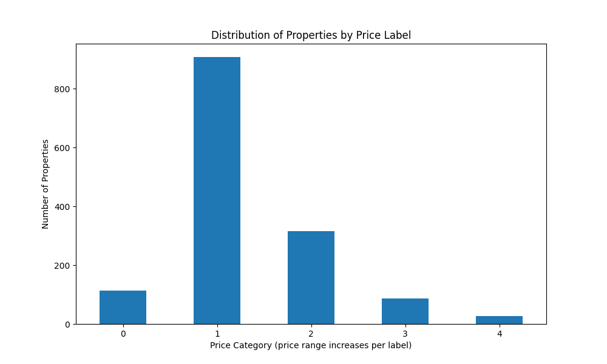
To remedy this we plan to adjust the ranges to create a more even distribution between all the categories.

## Feature Selection

## Clustering
Using clustering for visualization helps in identifying the structure of natural groupings in the data. Before clustering, we PCA-reduced the data to 2 to account for the curse of dimensionality as euclidean distance between points was used in all of the chosen clustering algorithms. In high-dimensional data, the euclidean distance becomes less informative compared to working in a 2D space. Through PCA-reduction, noise was removed in our 80-feature dataset while retaining the most meaningful features. This resulted in better average performance across the 3 clustering algorithms applied to the dataset.

Clustering results with original data (without PCA-reduction):
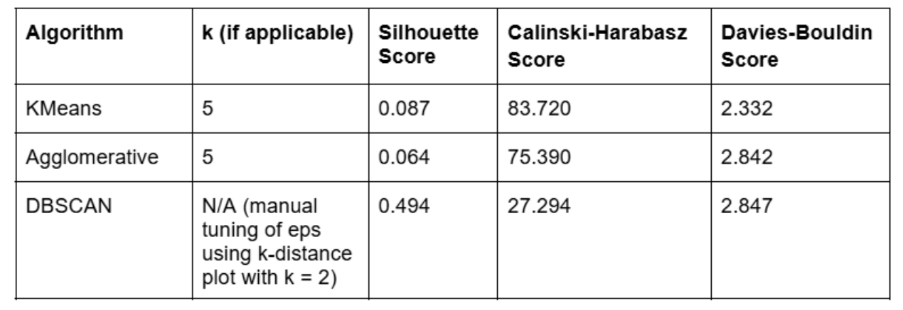
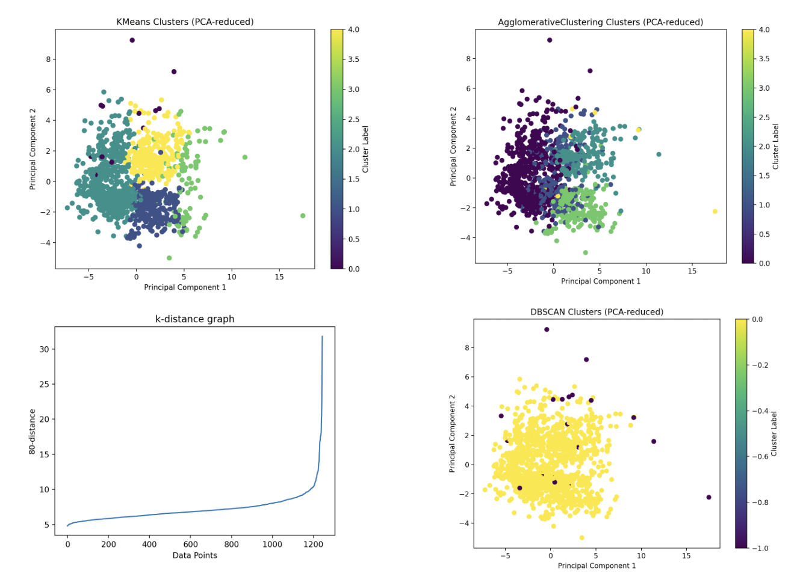
Clustering results with PCA-reduced data to 2 dimensions:
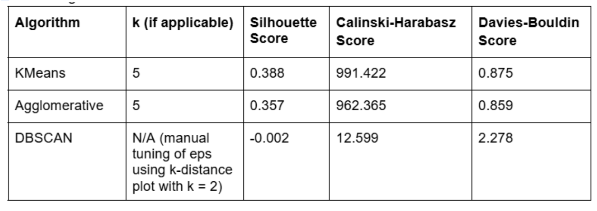
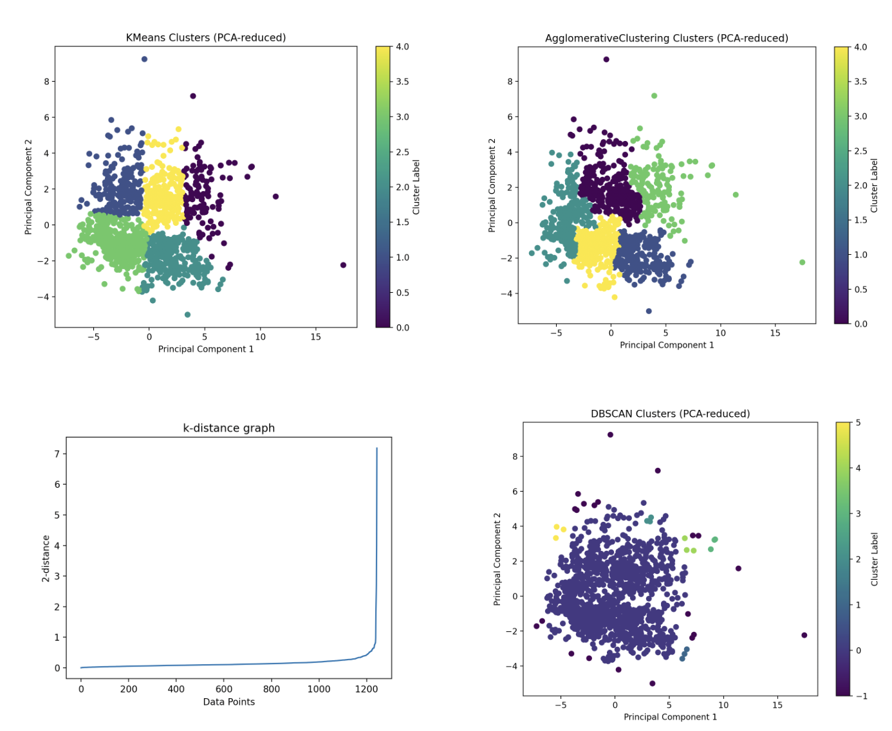

KMeans Clustering:
KMeans Clustering was not appropriate for our case as the algorithm works to produce k similar-sized, spherical clusters. As seen previously, our dataset retains some class imbalance in the extremes of the 5 classification bins. The Silhouette Score of 0.388 reflects a moderate performance as a set of well-defined clusters should result in a score closer to 1. Furthermore, the Calinski-Harabasz Score (high is optimal) of 991.422 and Davies-Bouldin (low is optimal) of 0.875 suggests that clusters are well-separated. In summary, these scores indicate that there exists a structure within the dataset.

Agglomerative Clustering:
Agglomerative Clustering resulted in similar performance to KMeans. In this algorithm, the number of clusters is not required as a parameter, it is an exploratory method that helps in finding hierarchical structure in the data. This is not appropriate for our case as there is no inherent hierarchical structure (parent-child/ancestor-descendant) among the data points of our housing dataset. Instead, the features in the housing dataset—such as price, size, number of bedrooms, location, and others are primarily continuous or categorical variables that represent the attributes of each house rather than any form of hierarchical relationship. Despite this, Agglomerative Clustering was still able to group data into clusters with similar feature profiles.

DBSCAN Clustering:
As seen in the plots previously, DBSCAN produced a different structure of clusters compared to the KMeans and Agglomerative algorithms. 
DBSCAN does not require the number of clusters as a parameter but it is sensitive to the input parameters eps and min_samples. eps controls the maximum distance between two points to be considered as members of the same cluster. min_samples specifies the minimum number of data points required to form a dense region, a cluster. With reduction to 2 dimensions, min_samples was set to 3 and eps was set to 0.7 by using the k-distance graph and finding the elbow point. 
Due to the dataset containing data points that are packed closely together in a dense region of the feature space, the result was one main dominant cluster with a few other clusters and outliers. Thus, the DBSCAN algorithm is not appropriate for the dataset as it fails to identify any sort of meaningful structure for our data other than detecting outliers.
The Silhouette Score of -0.002 is very low, indicating that the clustering is poor in a sense where clusters are too close to each other and the data points in one cluster are not well-separated from other clusters. The Calinski-Harabasz Score of 12.599 (low, sub-optimal) and Davies-Bouldin Score of 2.278 (high, sub-optimal) support this claim.

## Outlier Detection
Outlier detection helps in cleaning the data to perform better in classification and regression models. Outliers are values that aren’t consistent with the rest of the data, extremes that don’t belong. PCA-reduction to 2 dimensions was performed prior to outlier detection as data points are easier to visualize and comprehend. Before discussing the results, it is important to note that the data points in this dataset are quite densely packed with only a few data points outside of the “main cluster”.

Isolation Forest, Local Outlier Factor (LOF), and Elliptic Envelope outlier detection algorithms were applied to our data.

Plot of data points (PCA-reduced to 2D) and default parameters for each outlier detection algorithm:
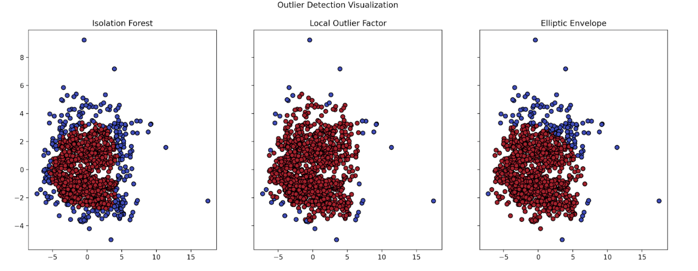

Isolation Forest:
This algorithm considered too many points as outliers when PCA was reduced to 2. Since this algorithm is fairly robust to high dimensional data, we tried running it with the original dataset and got better results, even with the default parameters.
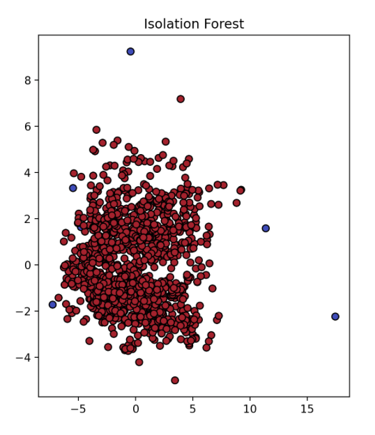

Local Outlier Factor:
This algorithm presented reasonable results with PCA-reduction to 2 dimensions but was re-ran with the original features for validity. With 80 original features, the 2D visualization is harder to understand but it does seem to have decreased sensitivity to some of the points declared as outliers in the run with PCA-reduction to 2. 
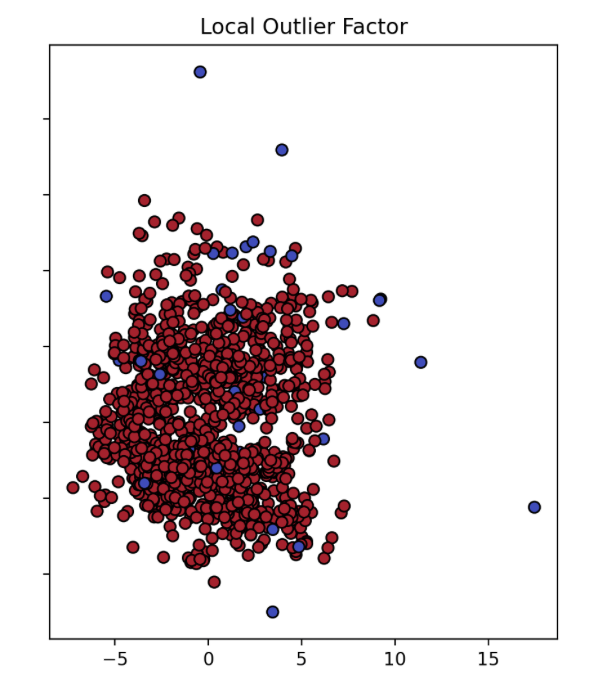

Elliptic Envelope:
This algorithm also considered too many points as outliers when run on our data with PCA-reduction to 2. Without PCA-reduction, the algorithm did not finish executing within a reasonable time frame. With PCA-reduction to 15 features, the visualization is not clear for understanding (left plot). With 2 dimensions and contamination set to 0.01 for the algorithm (1% of the data points are known to be outliers - an observation from previous results), a much clearer result was obtained (right plot).
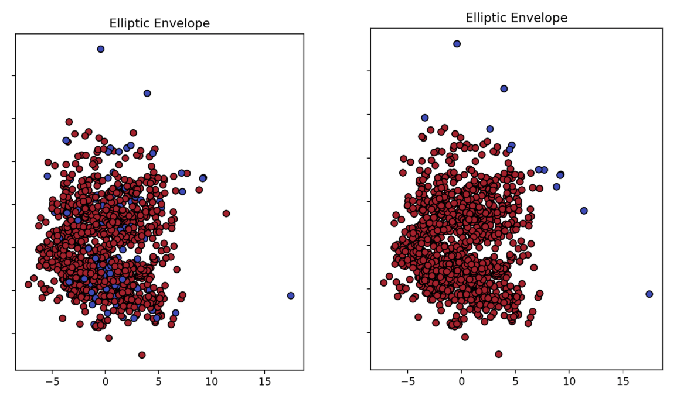

Verdict
Even with the few observed outliers in the visualizations, we have decided not to explicitly remove them. They represent a small portion of the data and have the possibility of being valid data points with extreme, but valid values for the features. In the case of house data, an outlier could potentially be a house with an extremely high number of rooms. Without a higher degree of confidence, it would be unreasonable to remove such data. 

## Classification

k-NN
With default parameters, the k-NN classifier was evaluated holdout usint 80/20 train/test split.

ROC curve and confusion matrix:
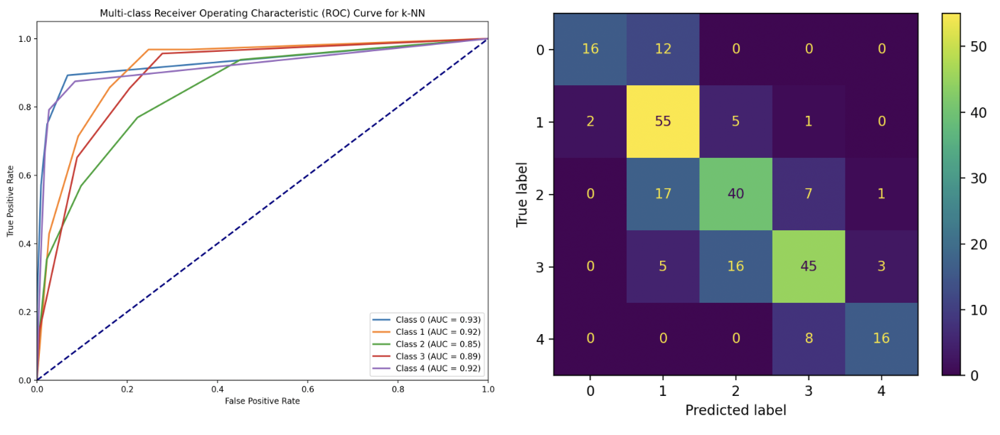

Random Forest:
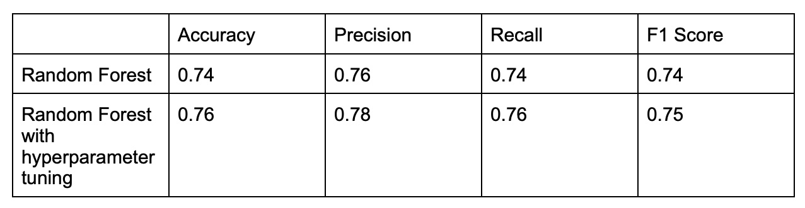

  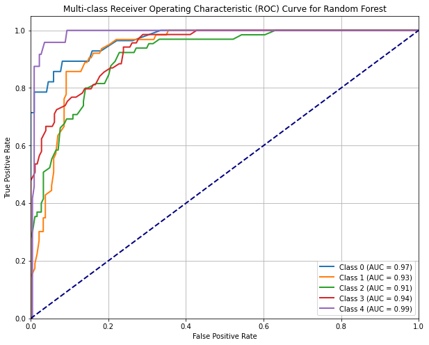
  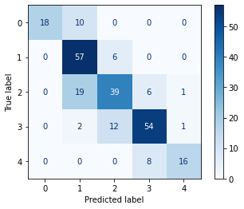

SVM:

As can be observed in the above table, the Random Forest classifier out-performed both the k-NN and SVM classifiers. This is likely because Random forest is an ensemble classifier and thus it is more robust to overfitting and also is better at handling imbalanced data. Additionally, the Random Forest classifier is better at handling high dimensional data as it can inherently compute feature importance, since it can prioritize the most relevant features for making predictions. This can result in better performance, especially with complex data and if some features are noisy or irrelevant. In contrast, k-NN and SVM do not have any ‘built-in’ way of computing feature importance. k-NN performs less well with imbalanced data because it considers the majority class is the nearest vicinity which will be biased if the data is imbalanced. k-NN also struggles with high-dimensional dense data, since there are a lot of data points within the same distance as one another. SVM can also be sensitive to unbalanced data and is highly dependent on hyperparameter tuning so if parameters are not well tuned it may not always perform well.

## Hyperparameter Tuning
Grid search was used to for hyperparameter tuning a random forest classifier. To reduce the amount of time it took to run, initially some random values were chosen for each parameter, but each of the following times the range of hyperparameter values to be tested were closer to the previous best hyperparameter found by the previous grid search.

  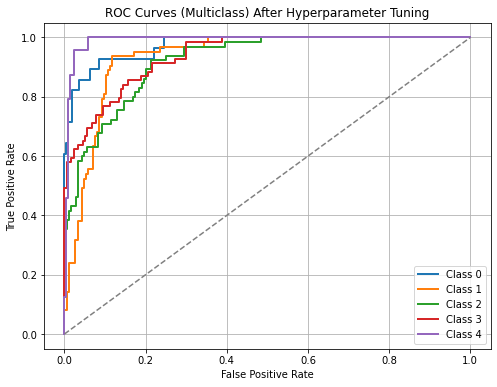
  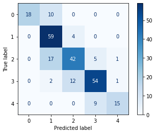

 

An increase in accuracy indicates a general improvement of model performance. Similarly, an increase in precision and recall reflect fewer false positive and false negative predictions respectively. Additionally, an increased F1 score signifies an improved balance between precision and recall. Hyperparameter tuning the Random Forest model resulted in relatively small but consistent improvements across all metrics, reflecting better overall model performance and reliability. These enhancements suggest that hyperparameter tuning has successfully optimized (by a small amount) the model for better generalization and prediction accuracy. Grid Search can be both time and memory constrained, thus if we had more memory or allowed the Grid search to run for a very long time there would most likely be better results.

## Insights and Lessons Learned

Some insights that were gained from performing these analyses was that the majority of the properties sold were within the range of $100,000 to $200,000. This fact was further compounded by the density of the data when clustered. From this we can infer that the majority of prospective property buyers prefer properties within that price range, which makes sense since that is a comparatively lower price range compared to the others. This suggests that real estate agents and developers may want to consider focusing their marketing and inventory on homes priced between $100,000 and $200,000 to cater to the majority of buyers in this range.

## Conclusion
Despite efforts to balance classes, minor imbalances persisted, particularly in extreme price ranges, affecting predictive accuracy. Future work could consist of exploring ensemble methods like XGBoost, other strategies to address imbalanced data, feature engineering, and considering transfer learning for feature extraction, all of which could further refine model performance. Furthermore, we would have liked to perform hyperparameter tuning for clustering, outlier-detection, and the other classification algorithms with anticipation of better results. Specifically for clustering, other distance metrics can be explored that are better suited to our high-dimensional dataset.

